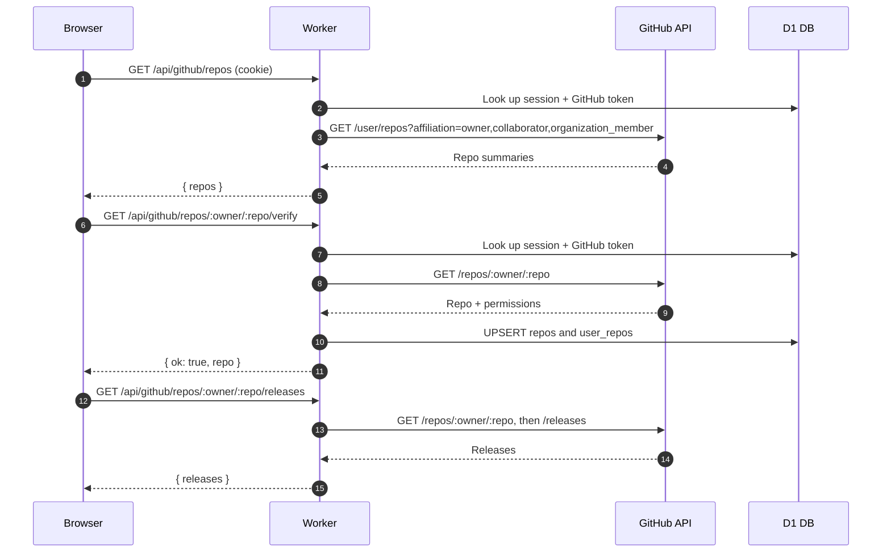
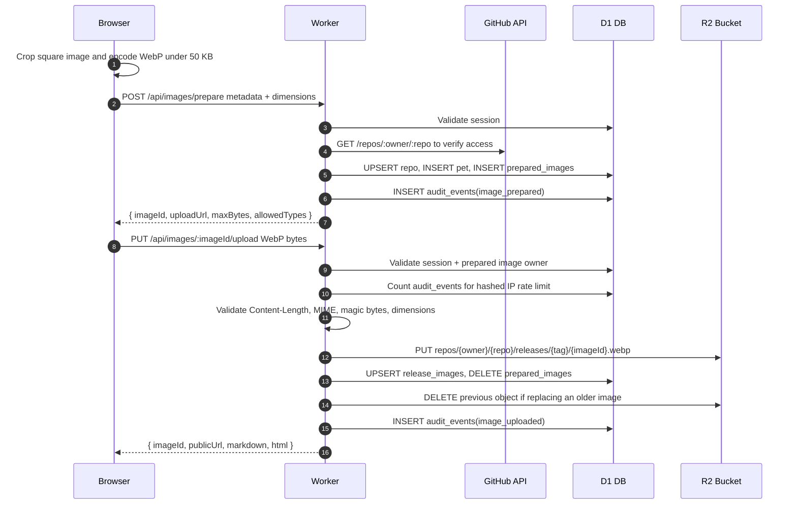
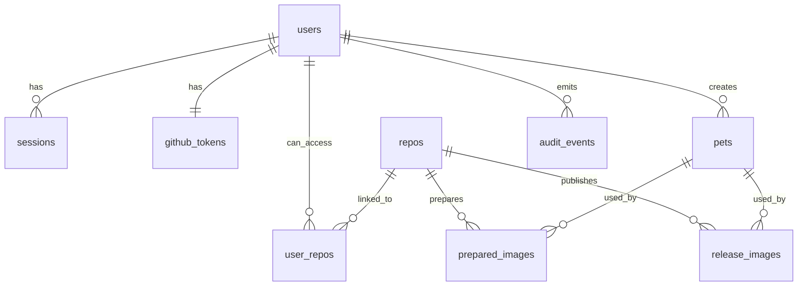

# ShipKitty Architecture and Data Flow

This document explains how ShipKitty is wired together so you can learn the current stack and follow requests from the browser, through Cloudflare, into storage, and back to the UI.

ShipKitty is a GitHub OAuth-authenticated pet/mascot image generator for GitHub release notes. The app lets a signed-in user verify access to a repo, crop/compress a pet image, upload it, and copy a permanent Markdown/HTML snippet into a release body.

## Stack summary

- **Frontend:** Vite + React + TypeScript in `src/`, deployed as static assets to Cloudflare Pages.
- **API:** TypeScript Cloudflare Worker in `worker/src/`.
- **Auth:** GitHub OAuth web flow handled by the Worker, with a Worker-managed HttpOnly session cookie.
- **Metadata:** Cloudflare D1 database bound to the Worker as `DB`.
- **Image storage:** Cloudflare R2 bucket bound to the Worker as `PET_IMAGES`.
- **Deployment/config:** Wrangler config in `worker/wrangler.toml`.

## Architecture at a glance

```txt
Browser / React SPA
  |  static HTML/CSS/JS from Cloudflare Pages
  |  /api/* requests + session cookie
  |  /r/* public image requests
  v
Cloudflare routing
  |  local dev: Vite proxy -> localhost:8787
  |  prod API: https://api.shipkitty.dev
  |  prod CDN/image host: https://cdn.shipkitty.dev
  v
Cloudflare Worker API (`shipkitty-api`)
  |-- GitHub OAuth + GitHub REST API calls
  |-- D1 (`DB`): users, sessions, repos, image metadata, audit events
  `-- R2 (`PET_IMAGES`): compressed WebP image bytes
```

### Local vs production routing

Local development runs two processes:

- `pnpm dev` starts Vite on `http://localhost:5173`.
- `pnpm dev:api` starts the Worker on `http://localhost:8787`.

`vite.config.ts` proxies these paths to the local Worker:

- `/api` -> `http://localhost:8787`
- `/r` -> `http://localhost:8787`

Production is split by hostnames in `worker/wrangler.toml`:

- Frontend static app: Cloudflare Pages, configured as `https://shipkitty.dev` in Worker vars.
- API Worker route: `https://api.shipkitty.dev`.
- Public image/CDN Worker route: `https://cdn.shipkitty.dev`.

The frontend can use same-origin API paths locally, but `build:prod` sets `VITE_API_BASE_URL=https://api.shipkitty.dev` so production browser API calls target the Worker API host.

## Repository layout

```txt
.
├── src/                     # React frontend
│   ├── App.tsx              # Main UI and workflow state
│   ├── api.ts               # Browser API client
│   ├── image.ts             # Browser crop/compress-to-WebP logic
│   └── components/          # UI components such as crop editor and selectors
├── public/                  # Static assets served by Vite/Pages
├── worker/
│   ├── wrangler.toml        # Cloudflare Worker, routes, vars, D1/R2 bindings
│   ├── src/                 # Worker API source
│   │   ├── index.ts         # Router and request handlers
│   │   ├── auth.ts          # Session cookie/hash helpers
│   │   ├── github.ts        # OAuth and GitHub REST helpers
│   │   ├── db.ts            # D1 query helpers
│   │   ├── validation.ts    # Upload byte/type/dimension validation
│   │   ├── markdown.ts      # Markdown/HTML snippet builder
│   │   ├── rateLimit.ts     # Upload rate limiting from audit events
│   │   └── constants.ts     # Upload limits and allowed MIME types
│   └── migrations/          # D1 schema migrations
├── package.json             # Frontend/Worker scripts
├── vite.config.ts           # Vite plugins and local proxy
├── AGENT.md                 # Project stack/context notes
└── README.md                # User-facing setup and endpoint notes
```

## Cloudflare configuration

`worker/wrangler.toml` is the Cloudflare source of truth for the Worker.

Important settings:

- Worker name: `shipkitty-api`
- Worker entrypoint: `worker/src/index.ts` (`main = "src/index.ts"` relative to `worker/wrangler.toml`)
- Compatibility date: `2026-06-08`
- D1 binding: `DB` -> database `petship-db`
- D1 database id: `1775b58a-52b3-4ab0-9c27-b3040ac85991`
- R2 binding: `PET_IMAGES` -> bucket `petship-images`

Runtime vars used by the Worker:

| Var | Purpose |
| --- | --- |
| `PUBLIC_CDN_BASE` | Base URL used when building public image URLs. Local default is `http://localhost:8787`; production is `https://cdn.shipkitty.dev`. |
| `APP_BASE_URL` | Worker/API base URL used for the GitHub OAuth callback. Local default is `http://localhost:8787`; production is `https://api.shipkitty.dev`. |
| `FRONTEND_BASE_URL` | Browser app URL used when redirecting back after OAuth. Local default is `http://localhost:5173`; production is `https://shipkitty.dev`. |
| `GITHUB_CLIENT_ID` | GitHub OAuth app client id. |

Secrets are not committed and must be set through Wrangler or the Cloudflare dashboard:

- `GITHUB_CLIENT_SECRET`
- `SESSION_SECRET`

## Frontend data flow

The frontend is a single React app.

Key files:

- `src/main.tsx` mounts `<App />` into the DOM.
- `src/App.tsx` owns the main UI state: auth state, selected repo, release tag, pet metadata, selected file, compressed image, upload status, and final Markdown result.
- `src/api.ts` wraps all Worker calls and uses `credentials: 'include'` where session cookies are needed.
- `src/image.ts` uses browser canvas APIs to crop to a square and encode WebP under the code-enforced 50 KB limit.
- `src/components/ImageCropEditor.tsx` provides the square crop UI.

Typical UI flow:

1. App loads and calls `getSession()` -> `GET /api/auth/me`.
2. If not signed in, user clicks **Sign in with GitHub**.
3. Browser navigates to `/api/auth/github/start?redirect=/`.
4. After OAuth, app has a session cookie and `GET /api/auth/me` returns the user.
5. User can load repos, manually verify owner/repo, and load releases.
6. User chooses pet metadata and a release tag.
7. User selects an image.
8. `ImageCropEditor` produces a square crop.
9. `compressImage()` crops/resizes/encodes the image to WebP under 50 KB.
10. Form submit calls `prepareImage()` -> `POST /api/images/prepare`.
11. Worker returns `{ imageId, uploadUrl, maxBytes, allowedTypes }`.
12. Frontend calls `uploadImage(uploadUrl, compressed.blob)` with `PUT`.
13. Worker stores the image and returns `{ imageId, publicUrl, markdown, html }`.
14. UI shows the public image link and copyable Markdown/HTML.

## Frontend API client contract

`src/api.ts` defines the browser-facing contract with the Worker.

Auth:

- `getSession()` -> `GET /api/auth/me`
- `logout()` -> `POST /api/auth/logout`

GitHub helper calls:

- `fetchGitHubRepos()` -> `GET /api/github/repos`
- `verifyGitHubRepo(owner, repo)` -> `GET /api/github/repos/:owner/:repo/verify`
- `fetchGitHubReleases(owner, repo)` -> `GET /api/github/repos/:owner/:repo/releases`

Image calls:

- `prepareImage(payload)` -> `POST /api/images/prepare`
- `uploadImage(uploadUrl, file)` -> `PUT /api/images/:imageId/upload`
- `fetchMarkdown(owner, repo, tag)` -> `GET /api/markdown?owner=&repo=&tag=`

All authenticated calls include cookies with `credentials: 'include'`. GitHub tokens are never exposed to React.

## Worker routing and API surface

`worker/src/index.ts` is the Worker entrypoint. The `fetch()` handler parses `new URL(request.url)`, branches by path/method, and delegates to handler functions.

### Auth endpoints

| Endpoint | Purpose |
| --- | --- |
| `GET /api/auth/github/start` | Starts GitHub OAuth, creates PKCE state, stores it in D1, redirects to GitHub. |
| `GET /api/auth/github/callback` | Consumes OAuth state, exchanges code for token, creates/updates user and session, redirects to frontend. |
| `GET /api/auth/me` | Returns current session user or `{ user: null }`. |
| `POST /api/auth/logout` | Deletes the session hash and clears the cookie. |

### GitHub helper endpoints

| Endpoint | Purpose |
| --- | --- |
| `GET /api/github/repos` | Lists accessible repos via GitHub `/user/repos`. |
| `GET /api/github/repos/:owner/:repo/verify` | Verifies repo access and stores repo/user permission metadata in D1. |
| `GET /api/github/repos/:owner/:repo/releases` | Verifies repo access, then lists GitHub releases. |

### Image endpoints

| Endpoint | Purpose |
| --- | --- |
| `POST /api/images/prepare` | Creates a temporary upload reservation and Markdown/HTML metadata. |
| `PUT /api/images/:imageId/upload` | Validates and stores the compressed WebP in R2, then publishes metadata to D1. |
| `GET /api/markdown?owner=&repo=&tag=` | Reads the active Markdown/HTML snippet for a repo release tag. |
| `GET /r/:owner/:repo/:tag/:imageId.webp` | Public image route. Looks up D1 metadata and streams the R2 object. |
| `GET /api/health` | Basic health response. |

The Worker also handles `OPTIONS` preflight requests with CORS headers and returns JSON-style errors through shared utilities.

## GitHub OAuth and session flow

The OAuth implementation lives mostly in `worker/src/index.ts`, `worker/src/github.ts`, `worker/src/auth.ts`, and `worker/src/db.ts`.

```mermaid
sequenceDiagram
  autonumber
  participant B as Browser
  participant W as Cloudflare Worker
  participant D as D1 DB
  participant G as GitHub

  B->>W: GET /api/auth/github/start?redirect=/
  W->>W: create state + PKCE verifier/challenge
  W->>D: INSERT oauth_states(state, code_verifier, expires_at)
  W-->>B: 302 redirect to GitHub authorize URL
  B->>G: User authorizes OAuth app
  G-->>B: Redirect to /api/auth/github/callback?code&state
  B->>W: GET /api/auth/github/callback?code&state
  W->>D: SELECT + DELETE oauth_states by state
  W->>G: POST /login/oauth/access_token
  G-->>W: access_token + scope
  W->>G: GET /user
  G-->>W: GitHub user profile
  W->>D: UPSERT users and github_tokens
  W->>D: INSERT sessions(session_hash, expires_at)
  W-->>B: Set-Cookie: petship_session; 302 to frontend
```

Session details:

- Cookie name: `petship_session`
- Lifetime: 30 days
- Flags: `HttpOnly`, `SameSite=Lax`, `Path=/`, and `Secure` on HTTPS non-localhost origins
- D1 stores only a session hash, not the raw session token
- The hash is derived from `SESSION_SECRET` plus the random session token

OAuth details:

- Current OAuth scope is `repo` so the app can list/verify public and private repositories.
- OAuth states expire after 10 minutes.
- Access tokens are stored server-side in `github_tokens` and are only used by Worker requests to GitHub.
- Token-at-rest encryption is a known hardening follow-up.

## Repo and release verification flow

GitHub repo access is checked on the server with the user's GitHub access token.



This design means the browser can ask for repo/release data without ever receiving the GitHub token.

## Image prepare/upload data flow

Image upload is intentionally split into two Worker calls:

1. **Prepare:** validate metadata and create a temporary upload reservation.
2. **Upload:** validate bytes, write R2, and publish the release image record.



### Prepare endpoint details

`POST /api/images/prepare`:

- Requires a valid logged-in session.
- Parses `owner`, `repo`, `releaseTag`, `petName`, `petTitle`, `caption`, `width`, and `height`.
- Normalizes URL path segments for owner/repo/tag.
- Requires image dimensions to be square (`width === height`).
- Verifies GitHub repo access using the user's token.
- Upserts the repo in D1 and links user permission metadata.
- Inserts a `pets` row.
- Creates an `imageId` and R2 key like:

```txt
repos/{owner}/{repo}/releases/{releaseTag}/{imageId}.webp
```

- Builds the public URL using `PUBLIC_CDN_BASE` in production or the local Worker origin in dev.
- Builds Markdown and HTML snippets.
- Inserts a `prepared_images` row with a 15-minute TTL.
- Audits `image_prepared` with a hashed IP.

### Upload endpoint details

`PUT /api/images/:imageId/upload`:

- Requires a valid logged-in session.
- Loads the `prepared_images` row by `imageId` and expiry.
- Confirms `prepared_images.user_id` matches the current session user.
- Applies upload rate limits from `audit_events`:
  - 10 uploads per hour per hashed IP.
  - 50 uploads per day per hashed IP.
- Validates upload data:
  - `Content-Length`, if present, must be valid and <= 50,000 bytes.
  - `Content-Type` must be `image/webp`.
  - Bytes must have WebP magic bytes (`RIFF` + `WEBP`).
  - WebP dimensions must be square.
  - Dimensions must match the prepared width/height.
- Writes the object to R2 with long-lived immutable cache metadata.
- Upserts `release_images` using the unique `(repo_id, release_tag)` constraint.
- Deletes the previous R2 object only after the new object is safely stored and D1 is updated.
- Deletes the consumed `prepared_images` row.
- Audits `image_uploaded`.

## D1 data model

D1 stores identity, session, GitHub access, image metadata, and audit records. Actual image bytes live in R2.



Main tables:

| Table | Purpose |
| --- | --- |
| `users` | Local user identity linked to GitHub user id, username, email, and avatar. |
| `oauth_states` | Temporary OAuth state, PKCE verifier, redirect path, and expiry. |
| `sessions` | Hashed session tokens and expiry. |
| `github_tokens` | Server-only GitHub access token, scope, and token type per user. |
| `repos` | Known repositories by owner/name and GitHub repo id. |
| `user_repos` | Per-user repo access link and GitHub permission level. |
| `pets` | Pet/mascot metadata generated by the user. |
| `prepared_images` | Temporary upload reservations containing intended metadata, R2 key, snippets, and expiry. |
| `release_images` | Active published image for a repo/release tag. |
| `audit_events` | Activity records used for auditing and rate limiting. |

Important constraints/indexes:

- `repos` has `UNIQUE(owner, name)`.
- `release_images` has `UNIQUE(repo_id, release_tag)`, enforcing one active image per release tag.
- `sessions.session_hash` is unique and indexed with expiry.
- `oauth_states.expires_at` is indexed for cleanup/lookup patterns.
- `audit_events` has indexes for IP/type/time and user/type/time queries.
- `prepared_images.expires_at` is indexed because prepared uploads are temporary.

## R2 and public image serving

R2 stores the image bytes. D1 stores the metadata that tells the Worker which R2 object to serve.

Upload write path:

```txt
PUT /api/images/:imageId/upload
  -> validate session + bytes
  -> PET_IMAGES.put(r2_key, bytes)
  -> release_images row points at r2_key
```

Public read path:

```txt
GET /r/:owner/:repo/:tag/:imageId.webp
  -> D1 lookup by owner/repo/tag/imageId
  -> PET_IMAGES.get(row.r2_key)
  -> stream object body to browser
```

Public image URLs are generated by the Worker:

- Local dev: use the current Worker origin, usually `http://localhost:8787`.
- Production: use `PUBLIC_CDN_BASE`, currently `https://cdn.shipkitty.dev`.

R2 objects are written with cache metadata:

```txt
Cache-Control: public, max-age=31536000, immutable
Content-Type: image/webp
```

This is safe because each image URL contains an `imageId`; replacements create a new URL/key and then delete the old R2 object after the new upload succeeds.

## Markdown and HTML generation

`worker/src/markdown.ts` builds both Markdown and HTML snippets from:

- pet name
- pet title
- caption
- public image URL

The Markdown is wrapped with markers:

```md
<!-- shipkitty:start -->
...
<!-- shipkitty:end -->
```

The app does **not** currently mutate GitHub release bodies automatically. The final output is copy-paste Markdown/HTML.

## Security and validation model

Security responsibilities are split between browser convenience checks and Worker-enforced checks.

Browser-side checks/convenience:

- File picker accepts PNG/JPEG/WebP.
- Crop editor encourages square output.
- Canvas compression converts the image to WebP.
- `src/image.ts` tries to keep the final blob <= 50 KB.

Worker-enforced checks:

- Upload endpoints require a valid session.
- Repo operations verify access with GitHub using the server-side access token.
- GitHub tokens never go to the browser.
- Session cookie is HttpOnly; D1 stores only a hash of the session token.
- Uploads must match a prepared image owned by the current user.
- API accepts compressed `image/webp` only.
- API validates byte size, MIME type, WebP magic bytes, square dimensions, and expected prepared dimensions.
- Uploads are rate-limited by hashed IP using `audit_events`.

Known hardening follow-up:

- Encrypt `github_tokens.access_token` at rest before storing it in D1.

## Local development mental model

Start local services:

```bash
pnpm install
pnpm db:migrate:local
pnpm dev       # Vite frontend on :5173
pnpm dev:api   # Worker API on :8787
```

For local OAuth, configure a GitHub OAuth app with:

```txt
Homepage URL: http://localhost:5173
Authorization callback URL: http://localhost:8787/api/auth/github/callback
```

Set local Worker secrets:

```bash
wrangler secret put GITHUB_CLIENT_SECRET --config worker/wrangler.toml
wrangler secret put SESSION_SECRET --config worker/wrangler.toml
```

The local flow works because Vite proxies browser `/api` and `/r` requests to the Worker, while the OAuth callback goes directly to `localhost:8787`.

## Deployment mental model

Common commands:

```bash
pnpm typecheck
pnpm test
pnpm build
pnpm db:migrate:remote
pnpm deploy:api
pnpm deploy:web
```

Production deployment pieces:

1. Apply D1 migrations with `pnpm db:migrate:remote`.
2. Deploy the Worker with `pnpm deploy:api`.
3. Build/deploy the Pages frontend with `pnpm deploy:web`.
4. Configure a production GitHub OAuth app callback to point to the Worker/API host:

```txt
https://api.shipkitty.dev/api/auth/github/callback
```

GitHub OAuth apps only support one callback URL, so local and production should use separate OAuth apps.

## Current constraints and caveats

- GitHub sign-in is required for new uploads.
- OAuth currently uses the broad `repo` scope to support public and private repo verification/pickers.
- There is no automatic GitHub release body update yet; users copy/paste Markdown or HTML.
- The code-enforced final upload limit is **50 KB** (`MAX_UPLOAD_BYTES = 50_000`). Some older README wording mentions 100 KB; treat that as stale unless the code is changed.
- API rejects SVG/GIF and accepts compressed WebP only.
- One active image is stored per `repo_id + release_tag`; replacements are atomic from the user's point of view and old R2 objects are deleted after the new upload succeeds.
- Public image serving depends on both D1 metadata and R2 object availability.

## Quick file map by responsibility

| Responsibility | File(s) |
| --- | --- |
| Main UI/workflow | `src/App.tsx` |
| Browser API calls | `src/api.ts` |
| Browser image compression | `src/image.ts` |
| Crop UI | `src/components/ImageCropEditor.tsx` |
| Worker router/endpoints | `worker/src/index.ts` |
| Sessions/cookies | `worker/src/auth.ts` |
| GitHub OAuth/API | `worker/src/github.ts` |
| D1 queries | `worker/src/db.ts` |
| Upload validation | `worker/src/validation.ts` |
| Rate limiting | `worker/src/rateLimit.ts` |
| Markdown/HTML snippets | `worker/src/markdown.ts` |
| Limits/constants | `worker/src/constants.ts` |
| Cloudflare bindings/routes | `worker/wrangler.toml` |
| D1 schema | `worker/migrations/*.sql` |
